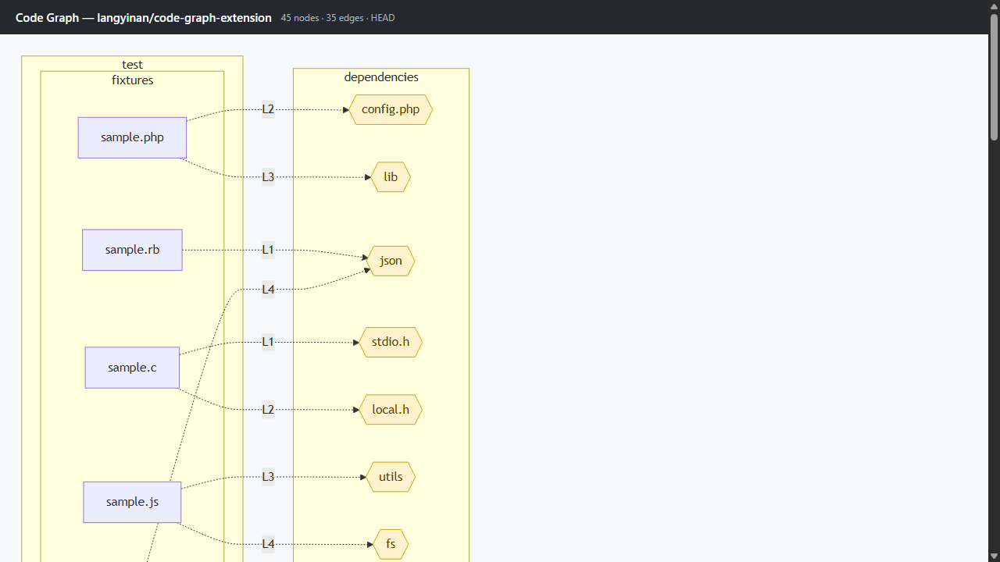

# Code Graph — Mermaid Dependency Viewer

A Chrome + Firefox extension that injects a **Code Graph** button into any GitHub repository page and renders an interactive [Mermaid](https://mermaid.js.org/) diagram showing:

- **Import / dependency edges** — which files import which, across all supported languages
- **Function call edges** — which functions call which helpers within a file (JS/TS/Python today)



## Why this exists

Tools like [GitDiagram](https://gitdiagram.com) and [DeepWiki](https://deepwiki.com) produce high-level system maps from file trees and READMEs. This extension goes deeper:

- Reads **actual source code**, not just file names
- Operates at **method / function level** granularity, not just module level
- Lives **in-place on GitHub** — no tab switching, no separate site
- Works on **private repos** (with a PAT) and **Firefox** as well as Chrome

## Quick start

### 1. Get Mermaid

Download `mermaid.min.js` from the [Mermaid releases](https://github.com/mermaid-js/mermaid/releases) and place it at `vendor/mermaid.min.js`.

```bash
curl -L https://cdn.jsdelivr.net/npm/mermaid/dist/mermaid.min.js -o vendor/mermaid.min.js
```

### 2. Load the extension

**Chrome / Edge**
1. Go to `chrome://extensions`
2. Enable **Developer mode**
3. Click **Load unpacked** → select this folder

**Firefox**
1. Go to `about:debugging#/runtime/this-firefox`
2. Click **Load Temporary Add-on** → select `manifest.json`

> Firefox uses MV2. A `manifest.firefox.json` with `manifest_version: 2` is on the roadmap.

### 3. (Optional) Add a GitHub token

Click the extension icon → enter a GitHub Personal Access Token to:
- Access **private repositories**
- Raise the API rate limit from 60 → 5000 requests/hour

Token needs `repo` scope for private repos; no scope needed for public.

## Supported languages

| Language | Imports | Call edges |
|----------|---------|------------|
| JavaScript / TypeScript | ✅ ESM + CJS | ✅ |
| Python | ✅ | ✅ |
| Go | ✅ | — |
| Rust | ✅ | — |
| Java | ✅ | — |
| Ruby | ✅ | — |
| PHP | ✅ | — |
| C# | ✅ | — |

## Architecture

```
manifest.json
├── background/
│   └── service-worker.js       # Orchestrates fetch + parse pipeline
├── content/
│   ├── inject.js               # Button injection + panel iframe
│   └── inject.css
├── panel/
│   ├── panel.html / .js / .css # Side panel with Mermaid renderer
├── popup/
│   └── popup.html / .js / .css # Token storage UI
├── options/
│   └── options.html            # Full options page
├── src/
│   ├── github/
│   │   └── fetchTree.js        # GitHub Trees + Contents API
│   ├── graph/
│   │   ├── Graph.js            # Node/edge model + Mermaid serializer
│   │   ├── buildGraph.js       # Orchestrates parse → resolve → prune
│   │   └── pruneGraph.js       # Removes isolated nodes, caps at 120 nodes
│   ├── parsers/
│   │   ├── parseImports.js     # Regex-based import extractors per language
│   │   └── parseCalls.js       # Intra-file call edge extractor (JS, Python)
│   └── storage/
│       └── settings.js
└── vendor/
    └── mermaid.min.js          # (not committed — see Quick start)
```

## Roadmap

- [ ] Tree-sitter WASM for accurate cross-file call resolution
- [ ] Click a node → jump to that file on GitHub
- [ ] Folder-level collapse / expand
- [ ] Firefox MV2 manifest
- [ ] Chrome Web Store + Firefox Add-ons listing
- [ ] LLM-assisted cluster labelling (optional, opt-in)

## Contributing

PRs welcome. Please open an issue first for anything beyond a small bug fix.

## License

MIT
